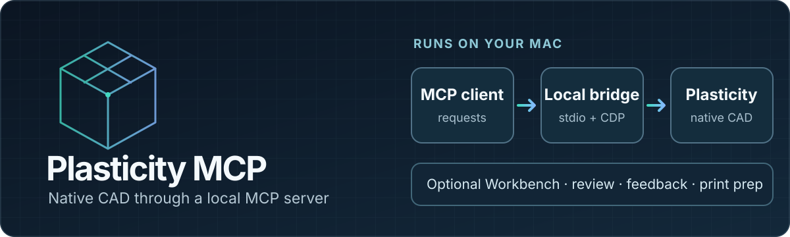

# Plasticity MCP



Control Plasticity from an MCP client: inspect and measure native CAD geometry, create and edit models, and export the result. An optional Workbench supports model review, dimensional feedback, and print preparation.

**Runs locally on macOS Apple Silicon with Plasticity 26.1.3.** The MCP server connects to a Plasticity window selected by the user; it cannot run as a standalone cloud CAD service.

| CAD workflow | What the server provides |
| --- | --- |
| Inspect | Scene state, precise B-rep measurements, and references to bodies, faces, and edges |
| Model | Native creation and editing with document history, Undo, and Redo |
| Deliver | Document operations, import/export, and camera screenshots |
| Review | Optional local Workbench with measurement tables, dimensional feedback, and tablet annotations |

The server uses Plasticity's own command factories and document history through a loopback-only Electron CDP endpoint. It does not patch or re-sign the application. MCP geometry inputs use millimeters and degrees; native edits support Plasticity Undo and Redo.

## What it provides

- Native Plasticity scene inspection, precise B-rep measurements, and revision-bound references to bodies, faces, and edges.
- Native CAD creation and editing, document operations, import/export, and camera screenshots.
- Agent guidance and workflows for image/sketch-driven design, functional clarification, fasteners, and practical strength screening.
- Optional Workbench for viewing models and measurement tables, submitting validated dimensional feedback, and tablet annotations on the same local network.
- Optional Creality Print workflow for slicing and print-job preparation. The agent waits for explicit user confirmation before starting a print.

See the [full tool reference](docs/tool-reference.md), [acceptance matrix](docs/acceptance-matrix.md), and [Workbench operations guide](docs/workbench-operations.md) for details and current verification status.

## Requirements

- macOS on Apple Silicon
- Plasticity 26.1.3 installed at `/Applications/Plasticity.app`
- Node.js 24 or newer
- Codex CLI for the Git-backed plugin installation below

This is an early, version-specific project. Live CAD and slicer operations depend on the installed applications and are not covered by mock tests alone. Check the [acceptance matrix](docs/acceptance-matrix.md) before relying on a specific operation.

## Install and run

```sh
git clone https://github.com/Mesteriis/plasticity-mcp.git
cd plasticity-mcp
npm install
npm run start:plasticity
npm run setup:codex
```

`setup:codex` adds this GitHub repository as a Codex plugin marketplace and installs the `plasticity-mcp` plugin from Git. It records this checkout's path in a private file under `~/.plasticity-mcp` so the two MCP servers can run the checked-out code and its installed dependencies. No machine-specific paths are committed. Open a new Codex chat after installation.

To use the MCP server without the plugin, register it directly instead:

```sh
codex mcp add plasticity -- npm --prefix "$PWD" start
```

Ask the agent to call `plasticity_list_windows`, then connect to an explicitly selected window with `plasticity_connect`.

The launcher does not terminate an existing Plasticity process to add MCP access. If it reports that a restart is needed, save your documents, close Plasticity yourself, then rerun the command. CDP listens on loopback only.

### Optional Workbench

The Workbench is not required for chat-based use. Start it on the local machine with:

```sh
npm run start:workbench
```

In another terminal on the same Mac, run `npm --workspace workbench run open:owner` to open an authenticated owner session. The server address alone does not grant owner access.

To make it reachable by a tablet on the same private network, run `npm run start:workbench -- --lan`; the server prints its local address. Do not expose it to the public internet. Follow the [Workbench guide](docs/workbench-operations.md) for registration, sharing, backup, and recovery.

## Development

```sh
npm test
npm run typecheck
npm --prefix workbench test
npm --prefix workbench run typecheck
npm --prefix workbench run build
```

Live acceptance checks use a real Plasticity session and can mutate a document. Read the corresponding acceptance guide and explicitly select a disposable test document before running them; they are not part of the default test suite.

## Safety and scope

- Mutations are serialized and checked against the current document revision; stale references are rejected.
- After a timeout or lost connection during a mutation, inspect/reconcile the scene before issuing another change.
- Workbench dimensional inputs are validated in the browser and again on the server.
- Print submission and starting a print are separate actions; starting requires explicit user confirmation.
- This project does not replace Plasticity, provide certified engineering analysis, or guarantee printability or part strength. Strength tools are screening calculations whose assumptions and limitations must be reviewed.

## Contributing and support

Read [CONTRIBUTING.md](CONTRIBUTING.md) before opening a pull request. Report security issues using the private reporting process in [SECURITY.md](SECURITY.md). See [SUPPORT.md](SUPPORT.md) for bug reports, feature requests, and usage questions. Contributions are released under the [MIT License](LICENSE), with copyright attributed to Aleksand Meshchriakov.
