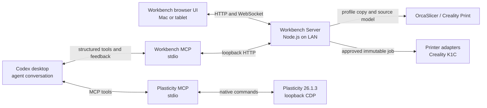

# Plasticity Workbench Platform Design

**Status:** Approved design

**Date:** 2026-09-20

**Primary platform:** macOS on Apple Silicon, Plasticity 26.1.3, Node.js 24

## Purpose

Plasticity Workbench is a local engineering workspace in which Codex can turn
photos, sketches, drawings, and existing CAD files into editable Plasticity
models, review those models with the user, and prepare verified print jobs.
The target work is functional product design: brackets, enclosures, stands,
fixtures, electronic housings, and mixed solid/surface parts. Figurine and
character workflows are outside the product focus.

Codex remains the primary agent. Plasticity remains the source of truth for
exact editable B-Rep geometry. A local browser interface supplies persistent
projects, structured requirements, interactive 3D review, stylus annotations,
manufacturing setup, and explicit print approval.

## Product principles

- Exact measurements come from Plasticity native B-Rep, never from a display
  mesh.
- Every inferred value is distinguishable from a verified value.
- A third-party model is a reference until its critical dimensions are
  checked.
- A user can edit in Plasticity, in structured Workbench controls, or by
  annotating the model; Codex reconciles all three paths through revisions.
- CAD mutations, slicing, and printer operations are serialized and
  observable.
- A command with an unknown outcome is reconciled before any retry.
- Preparing a print does not authorize starting a physical print.
- Printer, material, nozzle, and slicer are replaceable profiles rather than
  assumptions embedded in CAD logic.
- The first deployment stays local. No cloud service, reverse proxy, or
  internet-facing endpoint is required.

## System architecture



### Responsibility boundaries

**Workbench Server** owns projects, files, versions, annotations, structured
artifacts, browser sessions, and manufacturing jobs. It is the only service
exposed to the local network.

**Workbench MCP** exposes structured project, model-review, dimension-feedback,
manufacturing, and print-submission tools to Codex. Conversation remains in
Codex. The browser never proxies free-form chat or Codex approval callbacks.

**Plasticity MCP** owns exact scene inspection and native CAD operations. It
keeps its current loopback-only CDP connection, one-window ownership,
revision checks, serialized writes, and uncertain-outcome reconciliation.

**Slicer adapters** copy an installed preset into an immutable job workspace,
run the local slicer, and normalize its output and warnings. They do not edit
the user's global slicer configuration.

**Printer adapters** discover and address one printer family. They can upload
or start only a job whose exact file hash, printer, and profile have been
approved by the user.

## Local networking and pairing

The Workbench server binds to a selected private LAN address and port, for
example `http://192.168.1.25:4317`. It displays that URL and a QR code.
Plasticity CDP and the Workbench MCP HTTP client remain bound to `127.0.0.1`.

There is no reverse proxy, public tunnel, or remote access mode. A short-lived
pairing token grants a tablet one of three project roles: view, annotate, or
edit. Tokens can be revoked from the Mac. The service rejects non-private
source addresses and does not advertise itself beyond the local network.

## Project workspace

Project metadata is stored in SQLite. Large and independently useful files
stay on disk and are addressed by hash.

```text
project/
├── project.sqlite
├── references/
├── originals/
├── versions/
│   ├── v001/
│   └── v002/
├── annotations/
├── manufacturing/
├── gcode/
└── previews/
```

Every immutable model version can include:

- a `.plasticity` document;
- a STEP exchange file;
- a lightweight GLB display model;
- control screenshots;
- the exact Plasticity document token and revision;
- native B-Rep measurements;
- the construction journal;
- structured requirements and assumptions;
- validation results and user annotations;
- hashes and provenance for every input.

The display mesh is explicitly labelled approximate. Dimension tables retain
the measurement source for every row.

## Browser experience

The desktop layout has a project tree on the left and an interactive review
workspace with CAD review, version comparison, validated parameter forms, and
print preparation. Conversation and agent activity remain in Codex.

The 3D viewer supports body visibility, isolation, transparency, orthographic
views, section planes, selection, fit-to-selection, and annotations attached
to bodies, faces, edges, or world-space points. Selecting a dimension row
focuses and highlights its geometry. Selecting geometry filters related
requirements, measurements, and comments.

Codex can publish structured blocks into the review workspace:

- dimension tables with nominal, tolerance, actual, source, confidence, and
  status;
- requirements and constraints;
- assumptions that require review;
- source and provenance records;
- bills of materials and hardware;
- validation findings;
- manufacturing estimates;
- comparison tables;
- forms for missing values and design decisions.

Users can edit several structured values and submit them as one batch. A
batch becomes one structured Codex input and one reviewable modeling cycle.

## Tablet and stylus interaction

The same responsive web application runs in tablet Safari through the
short-lived LAN pairing link. Stylus interaction has three levels:

1. Draw or write over a saved camera view. Strokes retain the camera and a
   projected 3D anchor.
2. Draw on a selected face or construction plane. Codex converts strokes to
   lines, arcs, splines, and recognized profiles, then asks for missing exact
   dimensions.
3. Use constrained direct-edit controls for supported operations such as
   face offset, body transform, hole placement, fillet, chamfer, visibility,
   and Undo/Redo.

Drag previews use the display mesh. Committed edits are native Plasticity MCP
operations and return a new B-Rep-derived revision. A stale tablet operation
is rejected and retained as an annotation against its original version.

## Reference acquisition

Codex resolves external references in this order:

1. official manufacturer CAD;
2. official drawings, datasheets, or accessory guides;
3. official distributor or component-vendor CAD;
4. established CAD libraries;
5. independently checked community CAD;
6. a functional envelope built from verified dimensions;
7. reconstruction from scaled images.

Preferred input fidelity is STEP or Parasolid, then IGES, dimensioned 2D
documentation, STL or OBJ, and finally images. Every downloaded file retains
its URL, timestamp, original name, hash, license information when available,
and confidence assessment.

Confidence is assigned per dimension: verified, probable, approximate,
assumed, or measurement required. A reference can therefore have verified
overall dimensions while a connector height remains approximate. Critical
unknowns that affect fit must be shown to the user before final modeling.

Reference bodies are locked and assigned a scene role. When no trustworthy
full model exists, Codex builds only the functional envelope: contact zones,
keep-out volumes, mounting features, connector access, moving envelopes, and
manufacturing clearance.

## CAD tool model

The agent uses two tool layers.

The exact layer contains native operations for reference planes, profiles,
projection, trim/extend, extrude, revolve, sweep, loft, shell, draft, offset,
split, thicken, booleans, transforms, mirror, patterns, fillet/chamfer,
surface bridge/patch/trim/sew, selection, measurement, and validation.

The recipe layer expresses common functional features such as counterbores,
heat-set insert pockets, screw bosses, ribs, vents, snap fits, hinges, cable
channels, connector openings, mating enclosure halves, locating pins, and
printable joints. Recipes create ordinary editable Plasticity geometry and
record their inputs.

Semantic selection finds geometry by properties such as orientation, radius,
adjacency, bounds, and proximity instead of relying only on transient face or
edge IDs. Named selections are re-evaluated after every topology change and
become unresolved when the match is ambiguous.

The external construction journal records intent and exact inputs. After a
manual Plasticity edit, the change tracker marks which journal operations can
still be replayed and which region must continue through direct editing.

Every new native operation has a live compatibility probe against Plasticity
26.1.3 before it is advertised. An unavailable native factory is reported as
unsupported; the server does not silently switch to UI automation.

## Manufacturing profiles

A manufacturing profile is the versioned combination of:

- printer model and build volume;
- nozzle type and diameter;
- material, vendor, and color when relevant;
- slicer and preset version;
- quality target;
- functional intent and expected loads;
- calibrated hole, shrinkage, and joint compensation;
- connection and telemetry capability.

Profiles are official, imported, user-verified, or draft. The active plan
targets Creality K1C with Creality Print and OrcaSlicer. Other printer
ecosystems remain outside the active scope and completion criteria.

## Orientation, splitting, and slicing

Orientation scoring considers layer-direction strength, bed contact,
supports, functional-surface quality, hole accuracy, seam placement, print
time, material, and assembly access.

If a part does not fit, the agent first tries orientation, then diagonal
placement, natural part boundaries, and finally a proposed split. Supported
joint recipes include pins, tongue-and-groove, dovetail, screws and inserts,
snap fits, and aligned glue joints. Joint clearance is read from the active
printer/material profile.

Slicer adapters validate the target printer, build volume, layer settings,
temperatures, volumetric flow, support settings, filament estimate, isolated
regions, and model-to-G-code hash relationship. The user can inspect the
plate and layers before approval.

## Print authorization

Slicing and preview generation require no physical-action approval. Starting
a print requires an explicit user decision in the browser. Approval binds the
exact G-code hash, printer identity, manufacturing profile, model version,
and warning set. Any change invalidates the approval.

If communication fails while submitting a job, the result is unknown. The
adapter reads the printer queue or storage before any retry. It never sends a
second copy merely because the first call timed out.

## Failure and recovery rules

- Plasticity disconnect: persist the project and reconnect to the explicit
  window before continuing.
- CAD mutation timeout: mark the result unknown and reconcile the scene.
- Manual Plasticity edit: create a revision and compute the geometry diff.
- Stale tablet operation: reject the edit and preserve its annotation.
- Workbench restart: restore projects, pending annotations, and job states
  from SQLite.
- Slicer failure: retain source, copied profile, exit status, and bounded logs;
  do not create a printable job.
- Printer offline: keep the immutable approved artifact pending; do not start
  when the device reappears unless the original approval still applies.
- Printer submission timeout: reconcile remote storage/queue before retry.

## Delivery sequence

The platform is divided into independently testable subprojects:

1. Workbench Core and 3D Review.
2. Advanced Plasticity MCP and semantic geometry.
3. Reference acquisition and verification.
4. Manufacturing profile registry and design-for-printing checks.
5. Slicer integration and plate/layer review.
6. Printer adapters, approval, and local telemetry.

Each subproject receives its own implementation plan. The first useful release
ends after Workbench Core and 3D Review: the user keeps the conversation in
Codex, opens the same project on a tablet, sees a Plasticity-derived model,
reviews structured tables, and submits geometry-linked annotations.

## Platform acceptance

The complete platform is ready when a user can request a functional part from
a photo, sketch, product name, or existing model; review sources and missing
dimensions; obtain an editable verified Plasticity model; make and reconcile
manual or stylus edits; switch printer/material profiles; inspect the sliced
job; explicitly approve it; and send the exact approved artifact to the
selected local printer. Every step must survive a restart with provenance,
revision identity, and failure state intact.
